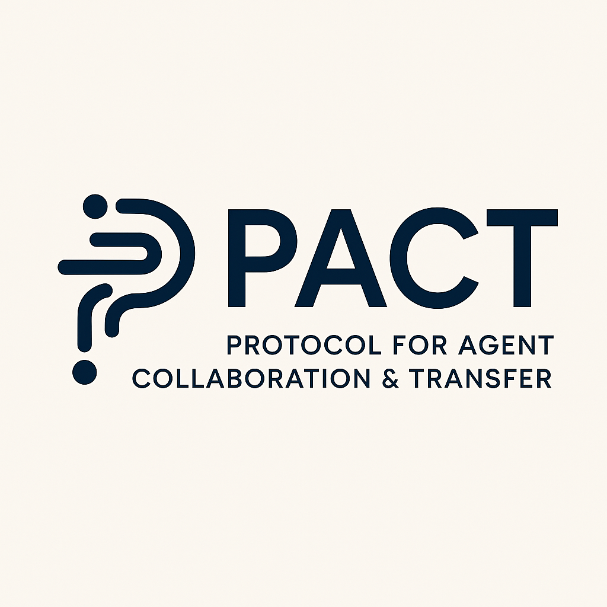
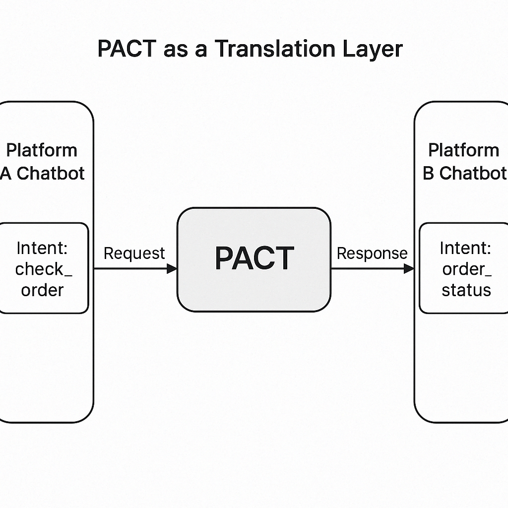
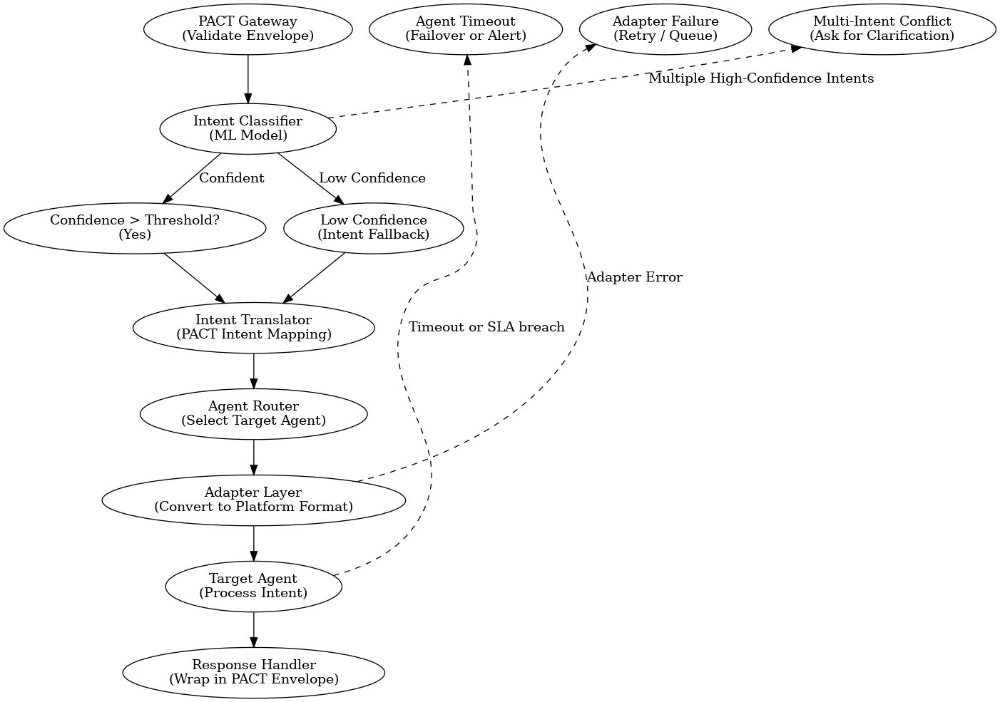

# 🧩 PACT Adapter MVP

**Protocol for Agent Collaboration & Transfer (PACT)** — Building the universal, lightweight communication layer for intelligent agents.



---
# 🧩 PACT Adapter MVP


---

## 🌍 Vision

In an increasingly agent-driven world, PACT provides a simple, open, and scalable protocol for **intent translation** and **agent interoperability** — enabling diverse AI agents, platforms, and services to collaborate seamlessly.

> "Let every agent have its mind... PACT translates their intents."

---

## 🌍 Current Protocol Landscape at a Glance

| Protocol | Focus          | Type                  | Owned By       | Strength                            |
|----------|----------------|-----------------------|----------------|--------------------------------------|
| **MCP** (Model Context Protocol) | App ↔ Model     | Vertical              | Anthropic       | Context & Tool Enrichment            |
| **A2A** (Agent2Agent)            | Agent ↔ Agent   | Horizontal            | Google          | Multi-agent Coordination             |
| **PACT** (Protocol for Agent Collaboration & Transfer) | Agent ↔ Agent | Horizontal + Middleware | **Vendor-neutral** | **Intent Translation & Interop**     |

---

## 🔍 How PACT Compares to Other Protocols

| Feature            | **PACT**                            | **MCP** (Model Context Protocol) | **A2A** (Agent-to-Agent)         |
|--------------------|-------------------------------------|----------------------------------|----------------------------------|
| **Focus**          | Intent translation & platform adaptation | Model-to-tool communication     | Agent-to-agent collaboration     |
| **Complexity**     | Lightweight                         | Medium                           | Comprehensive                    |
| **ML Integration** | Built-in                            | Limited                          | Optional                         |
| **Error Handling** | Extensive                           | Basic                            | Extensive                        |
| **Implementation** | Simple                              | Complex                          | Complex                          |
| **Use Case**       | Cross-platform messaging            | Tool augmentation                | Complex agent interactions       |


## 🚀 Quickstart

### Installation

```bash
git clone https://github.com/aknbloom/pact_adapter_mvp.git
cd pact_adapter_mvp
pip install -r requirements.txt
uvicorn main:app --reload
```

---

### Usage

Send a POST request to the `/translate` endpoint:

```bash
curl -X POST http://localhost:8000/translate \
  -H 'Content-Type: application/json' \
  -d '{
    "pact_version": "0.1",
    "message_id": "abc123",
    "timestamp": "2025-04-14T12:00:00Z",
    "sender": { "agent_id": "agent-A", "platform": "Dialogflow" },
    "recipient": { "agent_id": "agent-B", "platform": "Rasa" },
    "session": { "session_id": "xyz-123", "context": {} },
    "payload": {
      "intent": "check_order_status",
      "entities": { "order_id": "A123456" },
      "text": "Where is my order?"
    }
  }'
```

Example Response:

```json
{
  "translated_message": {
    "intent": "order.lookup",
    "entities": {
      "order_id": "A123456"
    },
    "text": "Where is my order?"
  }
}
```

---

## 🧩 System Architecture

## Architecture

PACT As a Translation Layer



The following diagram illustrates the PACT message flow:



- **PACT Gateway** → **ML Intent Classifier** → **Intent Translator** → **Agent Router** → **Adapter Layer** → **Target Agent** → **Response Handler**
- Resilient design with fallbacks for low-confidence intents, adapter failures, and timeouts.

Key components:
- **PACT Gateway**: Validates incoming message envelope format
- **ML Intent Classifier**: Determines intent with confidence score
- **Intent Translator**: Maps between different intent naming formats
- **Agent Router**: Selects appropriate target agent
- **Adapter Layer**: Converts to target platform's message format
- **Target Agent**: Processes the intent and generates a response
- **Response Handler**: Wraps response in standard PACT envelope
- **Resilient Design**: Built-in fallback mechanisms for low-confidence intents, timeouts, and adapter failures
- **Platform-Agnostic**: Works with any conversational AI platform
---

Protocol design isn't just about what works — it's about what fails gracefully and secures trust at every layer.
How PACT's security and resilience loop works (e.g., Inputs → Threat Modeling → Protocol Refinement → Resilience Mechanisms)?

## 📦 Docker Deployment

```bash
docker build -t pact-adapter .
docker run -p 8000:8000 pact-adapter
```

---

## 🛠 Features
- FastAPI webhook endpoint `/translate`
- Static intent mapping (easily extendable)
- Lightweight PACT envelope format
- Ready for extension with ML intent classifiers
- Docker-ready deployment
- Postman collection for local testing

---

## 🤝 Contributing

We welcome contributions!
- Fork the repository
- Submit a PR
- Help extend PACT toward a true open communication standard

See [CONTRIBUTING.md](./CONTRIBUTING.md) for full guidelines.

Good first issues:
- Extend adapter to support new platforms (Intercom, Zendesk)
- Add dynamic intent learning capabilities
- Enhance error and fallback handling

---

## 📄 License

MIT License - See [LICENSE](./LICENSE) for full text.

---

## 📬 Connect

For ideas, discussions, or collaborations:
- GitHub Discussions coming soon!
- Contact: founders@neurobloom.ai

Together, let's build the protocol layer for agent collaboration. 🌍
